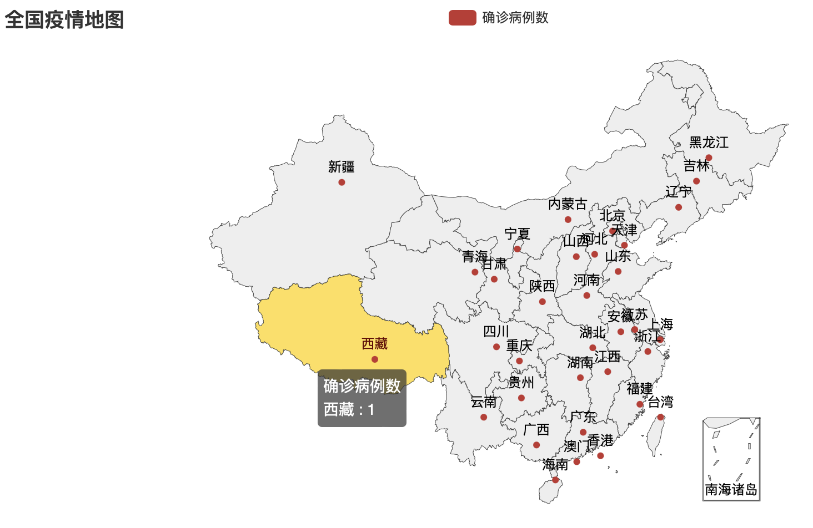

# Python 复习知识点

## 知识点

- 1\. Python程序需要**描述数据**和**操作数据**
- 2\. Python程序区分大小写
  - `ABC` / `Abc` / `abc` 是不同的标识符。
- 3\. 标识符的基本要求
  - 驼峰法则(`camelCase`) / 匈牙利法则(`Hungarian notation`)
  - 例如:
    - `iPhone`
    - `eBay`
    - `johnSmith`
- 4\. 变量赋值及相应的类型(主要的基本数据类型)

| 类型           | 典型值          |
| -------------- | --------------- |
| 布尔型(bool)   | `True`, `False` |
| 整形(int)      | `1`, `100`      |
| 浮点型(float)  | `3.1415926`     |
| 复数(complex)  | `1+2j`          |
| 字符串(string) | `'hello'`       |

- 5\. 注意`=`与`==`的区别
  - 赋值运算符(`=`) - `a = 10` 把`10`赋给变量`a`。
  - 比较运算符(`==`) - `a == 10` 比较`a`和`10`是否相等，相等返回`True`，不相等返回`False`。
- 6\. 特殊字符换行符`\n`


```python
print("hello\nworld")
```

    hello
    world


```python
print("hello", end="\n\n")
```

    hello
    


```python
print('a', 'b', 'c', sep='$$')
```

    a$$b$$c


```python
print(True, 1, 3.14, 1+2j, 'hello', sep=', ')
```

    True, 1, 3.14, (1+2j), hello


- 7\. Python语法的缩进格式(严格的逻辑关系、语句块)

  > Guido van Rossum 认为使用缩进进行分组非常优雅，并且对提高普通 Python 程序的清晰度有很大贡献。 大多数人会在一段时间后学会喜欢这个功能。


```python
a, b = 0, 1
while a < 10:
    print(a)
    a, b = b, a+b
```

    0
    1
    1
    2
    3
    5
    8


- 8\. 输入内置函数`input()`的使用、返回值。


```python
s = input('输入你的年龄:')
print(s)
```

    20


- 9\. 格式化输出`print()`的应用，包括宽度、小数点后位数等。


```python
print('1        10        20        30')
print('----+----|----+----|----+----|')
print(f'{3.1415926535897932384626:30.8}')
print(f'{3.1415926535897932384626:<30.8}')
print('     1        10        20        30')
print('     ----+----|----+----|----+----|')
print('Pi = {:30.8}'.format(3.1415926535897932384626))
print('Pi = {:<30.8}'.format(3.1415926535897932384626))
```

    1        10        20        30
    ----+----|----+----|----+----|
                         3.1415927
    3.1415927                     
         1        10        20        30
         ----+----|----+----|----+----|
    Pi =                      3.1415927
    Pi = 3.1415927                     


- 10\. 各种运算符
  - `+` - 数值的运算、字符串、列表等的拼接
  - `*` - 数值的运算、字符串、列表等的重复
  - `/` - 除法
  - `//` - 整除
  - `%` - 取余
  - `in` - 字符串、列表、元组、集合、字典等成员资格的判断
  - `+=`, `-=`, `*=`, `/=`, `//=`, `%=` - 扩展的赋值运算符


```python
# `+` - 数值的运算、字符串、列表等的拼接
print(1231+999999)                # 整数相加
print('Hello' + ' ' + 'World!')   # 字符串拼接
print([1, 3, 7] + [5, 7, 9, 11])  # 列表拼接
print((1, 3, 7) + (5, 7, 9, 11))  # 元组拼接
```

    1001230
    Hello World!
    [1, 3, 7, 5, 7, 9, 11]
    (1, 3, 7, 5, 7, 9, 11)


```python
# `*` - 数值的运算、字符串、列表等的重复
print(123321 * 3)                # 整数相乘
print('哈' * 7)                  # 字符串重复
print([1, 2, 3] * 5)             # 列表重复
print([[1, 2, 3]] * 5)           # 嵌套列表重复
print((1, True, "Good") * 3)     # 元组重复
print(((1, True, "Good"),) * 3)  # 嵌套的元组重复
print(('One',) * 3)              # 一个元素的元组重复
```

    369963
    哈哈哈哈哈哈哈
    [1, 2, 3, 1, 2, 3, 1, 2, 3, 1, 2, 3, 1, 2, 3]
    [[1, 2, 3], [1, 2, 3], [1, 2, 3], [1, 2, 3], [1, 2, 3]]
    (1, True, 'Good', 1, True, 'Good', 1, True, 'Good')
    ((1, True, 'Good'), (1, True, 'Good'), (1, True, 'Good'))
    ('One', 'One', 'One')


```python
# `/` - 除法
# `//` - 整除
# `%` - 取余
# 100 / 7 = 14 ... 2
a = 100 / 7
b = 100 // 7
c = 100 % 7
print(a, b, c, sep = ', ')
```

    14.285714285714286, 14, 2


```python
# `in` - 字符串、列表、元组、集合、字典等成员资格的判断
a = 'a' in 'abc'    # 字符串
b = 'lo' in 'hello' # 字符串
c = 1 in [1, 2, 3]  # 列表
d = 1 in (1, 2, 3)  # 元组
e = 1 in {1, 2, 3}  # 集合
f = 1 in {1: 'one', 2: 'two', 3: 'three'}              # 字典键
g = 'one' in {1: 'one', 2: 'two', 3: 'three'}.values() # 字典值
print(a, b, c, d, e, f, g, sep = ', ')
```

    True, True, True, True, True, True, True


```python
# `+=`, `-=`, `*=`, `/=`, `//=`, `%=` - 扩展的赋值运算符
x = y = 100
x = x + 10
y += 10
print('100 + 10 ->', x, y)

m = n = 100
m = m // 7
n //= 7
print('100 // 7 ->', m, n)
```

    100 + 10 -> 110 110
    100 // 7 -> 14 14


- 11\. 内置函数

| 函数                            | 用途                                                                                                                                   |
| ------------------------------- | -------------------------------------------------------------------------------------------------------------------------------------- |
| `pow(base, exp)`                | base ^ exp                                                                                                                             |
| `len(s)`                        | 返回对象的长度（元素个数）。实参可以是序列（如 string、bytes、tuple、list 或 range 等）或集合（如 dictionary、set 或 frozen set 等）。 |
| `eval(expression)`              | 表达式解析参数 expression 并作为 Python 表达式进行求值。                                                                               |
| `sum(iterable, start = 0)`      | 从 start 开始自左向右对 iterable 的项求和并返回总计值。 iterable 的项通常为数字，而 start 值则不允许为字符串。                         |
| `int(x, base=10)`               | 返回一个基于数字或字符串 x 构造的整数对象，或者在未给出参数时返回 0。                                                                  |
| `float(x)`                      | 返回从数字或字符串 x 生成的浮点数。                                                                                                    |
| `str(object='')`                | 返回一个 str 版本的 object 。                                                                                                          |
| `list([iterable])`              | 可以用多种方式构建列表                                                                                                                 |
| `tuple([iterable])`             | 可以用多种方式构建元组                                                                                                                 |
| `set([iterable])`               | 返回一个新的 set 或 frozenset 对象，其元素来自于 iterable。                                                                            |
| `dict()`                        | 返回一个新的字典，基于可选的位置参数和可能为空的关键字参数集来初始化。                                                                 |
| `zip(*iterables, strict=False)` | 在多个迭代器上并行迭代，从每个迭代器返回一个数据项组成元组。                                                                           |
| `enumerate(iterable, start=0)`  | 返回一个枚举对象。iterable 必须是一个序列，或 iterator，或其他支持迭代的对象。                                                         |


```python
a = pow(10, 2)
b = pow(10, 2) % 7
c = pow(10, 2, 7)
print(a, b, c, sep = ', ')
```

    100, 2, 2


```python
a = len('abc')                           # 字符串
b = len([1, 2, 3])                       # 列表
c = len((1, 2, 3))                       # 元组
d = len({1, 2, 3})                       # 集合
e = len([(1, 2, 3), ('foo', 'bar')])     # 元组的列表
f = len([(1, 2, 3), ('foo', 'bar')][0])  # 元组的列表的第0个元素
g = len([(1, 2, 3), ('foo', 'bar')][1])  # 元组的列表的第1个元素
print(a, b, c, d, e, f, g, sep=', ')
```

    3, 3, 3, 3, 2, 3, 2


```python
x = eval('100')
y = eval('3.1415926')
z = eval('x * y')
print(x, y, z, sep = ', ')
```

    100, 3.1415926, 314.15926


```python
a = sum((1, 2, 3))  # 元组
b = sum([1, 2, 3])  # 列表
c = sum({1, 2, 3})  # 集合
d = sum({1: 'one', 2: 'two', 3: 'three'})         # 字典键
e = sum({'one': 1, 'two':2,'three': 3}.values())  # 字典值
print(a, b, c, d, e, sep = ', ')
```

    6, 6, 6, 6, 6


```python
print(list(range(10)))
print(list({1, 2, 3}))
print(tuple([1, 2, 3]))
print(set((1, 2, 3)))

d = {1: 'one', 2: 'two', 3: 'three'}
print(list(d))
print(list(d.values()))
```

    [0, 1, 2, 3, 4, 5, 6, 7, 8, 9]
    [1, 2, 3]
    (1, 2, 3)
    {1, 2, 3}
    [1, 2, 3]
    ['one', 'two', 'three']


```python
# 构建字典
a = dict(one=1, two=2, three=3)
b = {'one': 1, 'two': 2, 'three': 3}
c = dict(zip(['one', 'two', 'three'], [1, 2, 3]))
d = dict([('two', 2), ('one', 1), ('three', 3)])
e = dict({'three': 3, 'one': 1, 'two': 2})
f = dict({'one': 1, 'three': 3}, two=2)
print(a, b, c, d, e, f, sep='\n')
```

    {'one': 1, 'two': 2, 'three': 3}
    {'one': 1, 'two': 2, 'three': 3}
    {'one': 1, 'two': 2, 'three': 3}
    {'two': 2, 'one': 1, 'three': 3}
    {'three': 3, 'one': 1, 'two': 2}
    {'one': 1, 'three': 3, 'two': 2}


```python
a = list(zip([1, 2, 3], ['one', 'two', 'three']))
b = list(enumerate(['one', 'two', 'three']))
c = list(enumerate(['one', 'two', 'three'], 1))
print(a, b, c, sep = '\n')
```

    [(1, 'one'), (2, 'two'), (3, 'three')]
    [(0, 'one'), (1, 'two'), (2, 'three')]
    [(1, 'one'), (2, 'two'), (3, 'three')]


- 12\. 字符串的正向反向索引、切片（左闭右开）的应用

| Index from front |   0   |   1   |   2   |   3   |   4   |   5   |   6   |   7   |   8   |   9   |  10   |  11   |
| ---------------: | :---: | :---: | :---: | :---: | :---: | :---: | :---: | :---: | :---: | :---: | :---: | :---: |
|  Index from back |  -12  |  -11  |  -10  |  -9   |  -8   |  -7   |  -6   |  -5   |  -4   |  -3   |  -2   |  -1   |
|           String |   a   |   b   |   c   |   d   |   e   |   f   |   g   |   h   |   i   |   j   |   k   |   l   |


```python
a = 'abcdefghijkl'[3]
b = 'abcdefghijkl'[-3]
c = 'abcdefghijkl'[3:7]
d = 'abcdefghijkl'[3:-2]
e = 'abcdefghijkl'[-10:-2]
f = 'abcdefghijkl'[3:]
g = 'abcdefghijkl'[:3]
h = 'abcdefghijkl'[:]
i = 'abcdefghijkl'[3:10:2]
j = 'abcdefghijkl'[3:-2:2]
k = 'abcdefghijkl'[::-1]
l = 'abcdefghijkl'[::-2]  # 从开始到结尾，- 代表倒序，步长2
print(a, b, c, d, e, f, g, h, i, j, k, l, sep = '\n')
```

    d
    j
    defg
    defghij
    cdefghij
    defghijkl
    abc
    abcdefghijkl
    dfhj
    dfhj
    lkjihgfedcba
    ljhfdb


- 13\. 字符串方法 - `split()`（只要求能读懂程序）
  - `str.split(sep=None, maxsplit=- 1)`
    > 返回一个由字符串内单词组成的列表，使用 sep 作为分隔字符串。 如果给出了 maxsplit，则最多进行 maxsplit 次拆分（因此，列表最多会有 maxsplit+1 个元素）。 如果 maxsplit 未指定或为 -1，则不限制拆分次数（进行所有可能的拆分）。


```python
strEng = 'the quick brown fox jumps over the lazy dog'
strChn = '敏捷的棕色狐狸跳过了懒狗'
a = strEng.split()
b = strEng.split(sep = 'o')
c = strChn.split()
d = strChn.split(sep = '的')
print(a, b, c, d, sep = '\n')
```

    ['the', 'quick', 'brown', 'fox', 'jumps', 'over', 'the', 'lazy', 'dog']
    ['the quick br', 'wn f', 'x jumps ', 'ver the lazy d', 'g']
    ['敏捷的棕色狐狸跳过了懒狗']
    ['敏捷', '棕色狐狸跳过了懒狗']


- 14\. 程序控制结构
  - 分支结构（单分支、双分支、多分支）
  - 循环结构的相关语法
  - 应用
    - `if ... elif ... else`
    - `for`
    - `while`
    - `for ... else` / `while ... else`
    - `break`
      - 
    - `continue`
      - 


```python
for num in range(-3, 3, 1):
    print('{:2} is a '.format(num), end = '')
    if num > 0:
        print("Positive number")
    elif num == 0:
        print("Zero")
    else:
        print("Negative number")
```

    -3 is a Negative number
    -2 is a Negative number
    -1 is a Negative number
     0 is a Zero
     1 is a Positive number
     2 is a Positive number


```python
for n in range(2, 10):
    for x in range(2, n):
        if n % x == 0:
            print(n, 'equals', x, '*', n // x)
            break
    else:
        # loop fell through without finding a factor
        print(n, 'is a prime number')
```

    2 is a prime number
    3 is a prime number
    4 equals 2 * 2
    5 is a prime number
    6 equals 2 * 3
    7 is a prime number
    8 equals 2 * 4
    9 equals 3 * 3


```python
genres = ['pop', 'rock', 'jazz']
for genre in genres:
    print("I like", genre)
```

    I like pop
    I like rock
    I like jazz


```python
for val in "string":
    if val == "i":
        break
    print(val)

print("The end")
```

    s
    t
    r
    The end


```python
for val in "string":
    if val == "i":
        continue
    print(val)

print("The end")
```

    s
    t
    r
    n
    g
    The end


```python
a = 0
while a < 30:
    print(a)
    if a < 3:
        a += 1
    elif a < 30:
        a += 10
    else:
        break
else:
    print('WoW')
```

    0
    1
    2
    3
    13
    23
    WoW


- 15\. 布尔表达式的使用

- 15.1 布尔运算

这些属于布尔运算，按优先级升序排列:

| 运算      | 结果                                 |
| --------- | ------------------------------------ |
| `x or y`  | if x is false, then y, else x        |
| `x and y` | if x is false, then x, else y        |
| `not x`   | if x is false, then True, else False |

- 15.2 比较运算

| 运算     | 含意           |
| -------- | -------------- |
| `<`      | 严格小于       |
| `<=`     | 小于或等于     |
| `>`      | 严格大于       |
| `>=`     | 大于或等于     |
| `==`     | 等于           |
| `!=`     | 不等于         |
| `is`     | 对象标识       |
| `is not` | 否定的对象标识 |

- 16\. 循环语句中可迭代的结构：range、字符串、列表、元组、集合、字典、文件
  - range 类型表示不可变的数字序列，通常用于在 for 循环中循环指定的次数。
    ```python
    range(stop)
    range(start, stop[, step])
    ```


```python
print(list(range(5)))
print(list(range(1, 5)))
print(list(range(0, 30, 5)))
```

    [0, 1, 2, 3, 4]
    [1, 2, 3, 4]
    [0, 5, 10, 15, 20, 25]


```python
for n in range(5):
    print(n, end=' ')
```

    0 1 2 3 4 


```python
for c in 'string':
    print(c, end = ' ')
```

    s t r i n g 


```python
for l in ['one', 'two', 'three']:
    print(l)
```

    one
    two
    three


```python
for k, v in {1:'one', 2:'two', 3:'three'}.items():
    print(k, v)
```

    1 one
    2 two
    3 three


- 17\. 列表操作的方法
  - `append(x)` - 在列表末尾添加一个元素。
  - `pop([i])` - 删除列表中指定位置的元素，并返回被删除的元素。未指定位置时，a.pop() 删除并返回列表的最后一个元素。


```python
fruits = ['orange', 'apple', 'pear', 'banana', 'kiwi', 'apple', 'banana']
print(fruits)
fruits.append('mongo')  # 追加一个元素
print(fruits)
fruits.pop(3)  # 删除第五个元素 banana
fruits.pop(3)  # 删除第五个元素 kiwi
print(fruits)
fruits.pop()   # 删除最后一个元素 mongo
print(fruits)
```

    ['orange', 'apple', 'pear', 'banana', 'kiwi', 'apple', 'banana']
    ['orange', 'apple', 'pear', 'banana', 'kiwi', 'apple', 'banana', 'mongo']
    ['orange', 'apple', 'pear', 'apple', 'banana', 'mongo']
    ['orange', 'apple', 'pear', 'apple', 'banana']


- 18\. 列表的排序方法`sort()`以及内置函数`sorted()`的应用场合、语法、排序规则的指定（lambda函数）、返回值等


```python
films = ['扬名立万', '英雄儿女', '梅艳芳', '沙丘', '我和我的父辈', '白毛女', '长津湖', '007', '大嫂归来']
scores = [8.3, 7.6, 9.5, 9.0, 8.9, 7.3, 9.8, 6.5, 5.0]

print("拓展1: 电影列表中的元素使用元组: (电影名 , 评分)，按评分排序并输出排名前三电影。")

# 元组
filmRatingTuple = list(zip(films, scores))
print(filmRatingTuple)

# 用 sort() 排序
filmRatingTuple.sort()
print(filmRatingTuple)

# 用 sort(key...) 排序
filmRatingTuple.sort(key=lambda x: x[1], reverse=True)
print(filmRatingTuple[0:3])

print("拓展2: 使用字典来存储上述信息:｛电影名:评分,……｝，按评分排序并输出排名前三电影。")

filmRatingDict = dict(zip(films, scores))
print(filmRatingDict)
print(sorted(filmRatingDict))
print(sorted(filmRatingDict.items()))
print(sorted(filmRatingDict.items(), key = lambda x: -x[1])[0:3])
```

    拓展1: 电影列表中的元素使用元组: (电影名 , 评分)，按评分排序并输出排名前三电影。
    [('扬名立万', 8.3), ('英雄儿女', 7.6), ('梅艳芳', 9.5), ('沙丘', 9.0), ('我和我的父辈', 8.9), ('白毛女', 7.3), ('长津湖', 9.8), ('007', 6.5), ('大嫂归来', 5.0)]
    [('007', 6.5), ('大嫂归来', 5.0), ('我和我的父辈', 8.9), ('扬名立万', 8.3), ('梅艳芳', 9.5), ('沙丘', 9.0), ('白毛女', 7.3), ('英雄儿女', 7.6), ('长津湖', 9.8)]
    [('长津湖', 9.8), ('梅艳芳', 9.5), ('沙丘', 9.0)]
    拓展2: 使用字典来存储上述信息:｛电影名:评分,……｝，按评分排序并输出排名前三电影。
    {'扬名立万': 8.3, '英雄儿女': 7.6, '梅艳芳': 9.5, '沙丘': 9.0, '我和我的父辈': 8.9, '白毛女': 7.3, '长津湖': 9.8, '007': 6.5, '大嫂归来': 5.0}
    ['007', '大嫂归来', '我和我的父辈', '扬名立万', '梅艳芳', '沙丘', '白毛女', '英雄儿女', '长津湖']
    [('007', 6.5), ('大嫂归来', 5.0), ('我和我的父辈', 8.9), ('扬名立万', 8.3), ('梅艳芳', 9.5), ('沙丘', 9.0), ('白毛女', 7.3), ('英雄儿女', 7.6), ('长津湖', 9.8)]
    [('长津湖', 9.8), ('梅艳芳', 9.5), ('沙丘', 9.0)]


- 19\. 元组的非正规写法
  - 多变量赋值
  - 两变量值交换


```python
# 多变量赋值
a, b, (c, d), e = 1, 3, (5, 7), 9
print(a, b, c, d, e, sep = ', ')

# 两变量值交换
x, y = 'hello', 'world'
x, y = y, x
print(x, y)
```

    1, 3, 5, 7, 9
    world hello


- 20\. 元组的基本要求和操作
  - 利用列表里面嵌套元组完成相应应用描述，并能进行操作
- 21\. 集合运算符：`&`, `|`, `-`（只要求能读懂程序）


```python
girls = {'Adele', 'Lady Gaga', 'G.E.M'}
boys = {'Jay Zhou', 'Ed Sheeran', 'Justin Bieber'}
chinese = {'G.E.M', 'Jay Zhou'}
singers = girls | boys
chineseBoys = chinese & boys
foreignGirls = girls - chinese
print(singers, chineseBoys, foreignGirls, sep = '\n')
```

    {'Adele', 'Justin Bieber', 'Lady Gaga', 'Ed Sheeran', 'G.E.M', 'Jay Zhou'}
    {'Jay Zhou'}
    {'Adele', 'Lady Gaga'}


- 22\. 集合操作的方法：`add()`


```python
girls = {'Adele', 'Lady Gaga', 'G.E.M'}
girls.add('WanTing')
print(girls)
```

    {'Adele', 'G.E.M', 'WanTing', 'Lady Gaga'}


- 23\. 集合的去除重复工作


```python
l = list('Hello world, my girl!')

# 顺序无关
unique = list(set(l))
print(unique)

# 顺序有关
unique = []
seen = set()
for e in l:
    if e in seen:
        continue
    else:
        unique.append(e)
        seen.add(e)
print(unique)
```

    ['o', 'm', ',', 'l', '!', 'e', 'y', ' ', 'd', 'r', 'i', 'w', 'g', 'H']
    ['H', 'e', 'l', 'o', ' ', 'w', 'r', 'd', ',', 'm', 'y', 'g', 'i', '!']


- 24\. 字典添加新的键值对


```python
d = {'whale': 5, 'shark': 3}
print(d)
d['python'] = 9 # Add 1
print(d)
d.update({'shrimp': 10000, 'kraken': 1, 'serpant': 2}) # Add many
print(d)
```

    {'whale': 5, 'shark': 3}
    {'whale': 5, 'shark': 3, 'python': 9}
    {'whale': 5, 'shark': 3, 'python': 9, 'shrimp': 10000, 'kraken': 1, 'serpant': 2}


- 25\. 字典中键、值、键值对的获取 `keys()`, `values()`, `items()`
  - 对字典元素的迭代默认情况是对键的迭代
  - 能够用字典描述特定键值对类型的应用并操作


```python
d = {'whale': 5, 'shark': 3, 'python': 19}
print(d.keys())
print(d.values())
print(d.items())
for k in d:
    print(k)
for k, v in d.items():
    print('the number of {:<6} = {:>2}'.format(k, v))
```

    dict_keys(['whale', 'shark', 'python'])
    dict_values([5, 3, 19])
    dict_items([('whale', 5), ('shark', 3), ('python', 19)])
    whale
    shark
    python
    the number of whale  =  5
    the number of shark  =  3
    the number of python = 19


- 25.1 词云


```python
"""
  程序功能：实现词频的统计
"""
from wordcloud import WordCloud
import matplotlib.pyplot as plt  # 绘制图像的模块
import jieba  # 分词模块

sentence = "今天全没月光我知道不妙早上小心出门贵翁的眼色便怪：似乎怕我似乎想害我还有七八个人交头接耳的议论我张着嘴对我笑了一笑我便从头直冷到脚根晓"
wordList = jieba.lcut(sentence)

wordDic = {}  # 定义一个空字典

for word in wordList:
    if word in wordDic.keys():
        wordDic[word] = wordDic[word] + 1
    else:
        wordDic[word] = 1
print(wordDic)

wordcloud = WordCloud(
    # 设置字体，不然会出现口字乱码，文字的路径是电脑的字体一般路径，可以换成别的
    font_path="~/Library/Fonts/sarasa-ui-sc-regular.ttf",
    # 设置了背景，宽高
    background_color="white", width=1000, height=880).generate_from_frequencies(wordDic)

plt.imshow(wordcloud, interpolation="bilinear")
plt.axis("off")
plt.show()
```

    Building prefix dict from the default dictionary ...
    Loading model from cache /var/folders/p9/ym64x6r96qbbcfswwvcnnn5m0000gn/T/jieba.cache
    Loading model cost 0.706 seconds.
    Prefix dict has been built successfully.


    {'今天': 1, '全没': 1, '月光': 1, '我': 5, '知道': 1, '不妙': 1, '早上': 1, '小心': 1, '出门': 1, '贵翁': 1, '的': 2, '眼色': 1, '便怪': 1, '：': 1, '似乎': 2, '怕': 1, '想害': 1, '还有': 1, '七八个': 1, '人': 1, '交头接耳': 1, '议论': 1, '我张': 1, '着': 1, '嘴': 1, '对': 1, '笑': 1, '了': 1, '一笑': 1, '便': 1, '从头': 1, '直冷到': 1, '脚': 1, '根晓': 1}


    

    


- 26\. 字典的`get()`方法的作用及使用

  `get(key[, default])`
  > 如果 key 存在于字典中则返回 key 的值，否则返回 default。 如果 default 未给出则默认为 None，因而此方法绝不会引发 KeyError。


```python
d = {'whale': 5, 'shark': 3, 'python': 19}
print(d['whale'])
# print(d['shrimp'])         # shrimp 不存在，报错
print(d.get('whale'))
print(d.get('shrimp'))       # shrimp 不存在，不报错
print(d.get('shrimp', 999))  # shrimp 不存在，返回默认值
```

    5
    5
    None
    999


- 27\. 函数定义及简单参数传递


```python
# 斐波那契数列
def fib(n):
    a, b = 0, 1
    while a < n:
        print(a, end=' ')
        a, b = b, a + b
    print()

fib(2000)
```

    0 1 1 2 3 5 8 13 21 34 55 89 144 233 377 610 987 1597 


- 28\. 使用pip工具查看当前已安装的Python扩展库的完整命令`pip list`，安装扩展库命令`pip install`库名。


```python
pip list
```

    Package              Version
    -------------------- ---------
    appdirs              1.4.4
    appnope              0.1.2
    argon2-cffi          21.3.0
    argon2-cffi-bindings 21.2.0
    attrs                21.2.0
    autopep8             1.5.7
    backcall             0.2.0
    black                21.9b0
    bleach               4.1.0
    cffi                 1.15.0
    click                8.0.1
    cycler               0.11.0
    debugpy              1.5.0
    decorator            5.1.0
    defusedxml           0.7.1
    entrypoints          0.3
    fonttools            4.28.5
    importlib-metadata   4.10.0
    ipykernel            6.4.1
    ipython              7.28.0
    ipython-genutils     0.2.0
    jedi                 0.18.0
    jieba                0.42.1
    Jinja2               3.0.3
    jsonschema           4.3.2
    jupyter-client       7.0.6
    jupyter-core         4.8.1
    jupyterlab-pygments  0.1.2
    kiwisolver           1.3.2
    MarkupSafe           2.0.1
    matplotlib           3.5.1
    matplotlib-inline    0.1.3
    mistune              0.8.4
    mypy-extensions      0.4.3
    nbclient             0.5.9
    nbconvert            6.3.0
    nbformat             5.1.3
    nest-asyncio         1.5.1
    notebook             6.4.6
    numpy                1.21.5
    packaging            21.3
    pandas               1.3.5
    pandocfilters        1.5.0
    parso                0.8.2
    pathspec             0.9.0
    pexpect              4.8.0
    pickleshare          0.7.5
    Pillow               8.4.0
    pip                  21.3.1
    platformdirs         2.3.0
    prettytable          2.5.0
    prometheus-client    0.12.0
    prompt-toolkit       3.0.20
    ptyprocess           0.7.0
    pycodestyle          2.8.0
    pycparser            2.21
    pyecharts            1.9.1
    pyee                 8.2.2
    Pygments             2.10.0
    pyparsing            3.0.6
    pyppeteer            0.2.6
    pyrsistent           0.18.0
    python-dateutil      2.8.2
    pytz                 2021.3
    pyzmq                22.3.0
    regex                2021.8.28
    Send2Trash           1.8.0
    setuptools           59.0.1
    simplejson           3.17.6
    six                  1.16.0
    terminado            0.12.1
    testpath             0.5.0
    toml                 0.10.2
    tomli                1.2.1
    tornado              6.1
    tqdm                 4.62.3
    traitlets            5.1.0
    typing-extensions    3.10.0.2
    urllib3              1.26.7
    wcwidth              0.2.5
    webencodings         0.5.1
    websockets           9.1
    wheel                0.37.0
    wordcloud            1.8.1
    zipp                 3.6.0
    Note: you may need to restart the kernel to use updated packages.


```python
pip install pandas
```

- 29\. 文件打开模式
  - `r` - 读模式
  - `w` - 写模式
  - `a` - 追加模式
- 30\. 读文本文件的方法
  - `read()` - 打开 file 并返回对应的 file object。
  - `readlines()` - 从流中读取并返回包含多行的列表。
  - 对文件对象的迭代默认情况是`readlines()`
    - 请注意使用 `for line in file: ...` 就足够对文件对象进行迭代了，可以不必调用 `file.readlines()`。
- 31\. 写文本文件的方法：`writelines()`


```python
# 打开文件的两种方式
# 1 - open() 函数，需要 close() 函数配合关闭文件
f = open('./files/test.txt', 'r', encoding = 'utf8')
print(f.read())
f.close()

# 2 - `with open` 语法确保文件一定会关闭
with open('./files/test.txt', 'r', encoding='utf8') as f:
    print(f.read())
print(f.closed)
```

    line 1 - 常记溪亭日暮, 沉醉不知归路。
    line 2 - 兴尽晚回舟, 误入藕花深处。
    line 3 - 争渡, 争渡, 惊起一滩鸥鹭。
    
    line 1 - 常记溪亭日暮, 沉醉不知归路。
    line 2 - 兴尽晚回舟, 误入藕花深处。
    line 3 - 争渡, 争渡, 惊起一滩鸥鹭。
    
    True


- 第14周的例子


```python
with open('./files/test.txt', 'r') as file1:  # 上下文管理器
    # 一次性读取整个文件
    print("read() 方法的结果.....")
    print(type(file1.read()))
    file1.seek(0)  # 将文件定位于文件头 1代表当前位置 ，2代表文件结尾
    print(file1.read())

    # 按行读取文件
    print("readline() 方法的结果.....")
    file1.seek(0)
    print(type(file1.readline()))
    print(file1.readline())

    # 以列表方式读入数据
    print("以列表方式读入数据")
    file1.seek(0)
    lines = file1.readlines()
    print(type(lines))
    print(lines)
    print(len(lines))
```

    read() 方法的结果.....
    <class 'str'>
    line 1 - 常记溪亭日暮, 沉醉不知归路。
    line 2 - 兴尽晚回舟, 误入藕花深处。
    line 3 - 争渡, 争渡, 惊起一滩鸥鹭。
    
    readline() 方法的结果.....
    <class 'str'>
    line 2 - 兴尽晚回舟, 误入藕花深处。
    
    以列表方式读入数据
    <class 'list'>
    ['line 1 - 常记溪亭日暮, 沉醉不知归路。\n', 'line 2 - 兴尽晚回舟, 误入藕花深处。\n', 'line 3 - 争渡, 争渡, 惊起一滩鸥鹭。\n']
    3


- 迭代文件 - 对文件对象的迭代默认情况是`readlines()`。


```python
with open('./files/test.txt', 'r') as f:
    for line in f:
        print(line, end = '')
```

    line 1 - 常记溪亭日暮, 沉醉不知归路。
    line 2 - 兴尽晚回舟, 误入藕花深处。
    line 3 - 争渡, 争渡, 惊起一滩鸥鹭。


- 写文件


```python
import random
import string
import os

# 创建一个临时文件
filename = ''.join(random.choices(string.ascii_uppercase + string.digits, k=8)) + '.txt'
f = open(filename, 'x')
f.close()

# writelines() - 注意换行符
with open(filename, 'w') as f:
    f.writelines(['《盗梦空间》', '《无间道》', '《活着》'])
    f.writelines(['《2046》\n', '《重慶森林》\n', '《花樣年華》\n'])

with open(filename, 'r') as f:
    for line in f:
        print(line, end = '')

# 删除临时文件
os.remove(filename)
```

    《盗梦空间》《无间道》《活着》《2046》
    《重慶森林》
    《花樣年華》


- 32\. CSV库，JSON库读写文件操作的基本语法


```python
# 方法1 按文本方式读取csv文件
print("# 按文本方式读取csv文件")
with open('./files/test.csv', 'r', encoding='utf-8') as fp:
    print(fp.readlines())

# 方法2 用CSV模块来读取csv文件
import csv

print("# 用CSV模块来读取csv文件")
with open('./files/test.csv', 'r', encoding='utf-8') as fp:
    reader = csv.reader(fp)
    aList = list(reader)
    print(aList)

# 用CSV模块来写csv文件
blist = [['佛山', '101.5', '120.7', '121.4'], ['江门', '101.5', '120.7', '121.4']]
with open('./files/test.csv', 'a+') as f:
    writer = csv.writer(f, lineterminator='\n')
    for item in blist:
        writer.writerow(item)

```

    # 按文本方式读取csv文件
    ['佛山,101.5,120.7,121.4\n', '江门,101.5,120.7,121.4\n']
    # 用CSV模块来读取csv文件
    [['佛山', '101.5', '120.7', '121.4'], ['江门', '101.5', '120.7', '121.4']]


```python
import json

with open('./files/beijing_aqi.json', 'r', encoding='utf-8') as fp:
    cityList = json.load(fp)
    print(type(cityList))
    print(len(cityList))
    print(cityList[0])
    """1 使用列表对象本身来进行排序"""
    # cityList.sort(key = lambda  x:x['aqi'])
    # print(cityList)
    """2 使用内置函数sorted进行排序"""
    sortedAQI = sorted(cityList, key=lambda x: x['aqi'])

    with open('./files/aqi_top5.json', 'w', encoding='utf-8') as fp2:
        json.dump(sortedAQI[:5], fp2, ensure_ascii=False, indent=8)
```

    <class 'list'>
    13
    {'aqi': 47, 'area': '北京', 'pm2_5': 32, 'pm2_5_24h': 33, 'position_name': '万寿西宫', 'primary_pollutant': None, 'quality': '优', 'station_code': '1001A', 'time_point': '2017-07-29T14:00:00Z'}


- 33\. 上下文管理器的应用
  - `with open() as f:` - 参见 29-31 知识点代码

- 34\. 第三方库random的方法：`randint()`


```python
import random
random.seed(5)
x = random.randint(0, 9)  # 唯一的闭区间[0, 9]
random.seed(5)            # 同样的seed
y = random.randint(0, 9)  # 得到同样的随机数
print(x, y)
```

    9 9


```python
import random
cards = list('A23456789JQK')
random.shuffle(cards)
print(cards)
random.shuffle(cards)
print(cards)
```

    ['3', '4', 'K', 'Q', 'J', '2', '7', '8', 'A', '9', '6', '5']
    ['9', 'K', '6', '2', '3', '5', 'J', '4', 'A', '7', 'Q', '8']


- 35\. 可视化
- 35.1 绘制饼图


```python
import matplotlib.pyplot as plt

plt.rcParams['font.sans-serif'] = ['Sarasa UI SC']
plt.rcParams['axes.unicode_minus'] = False
gradeCount = [20, 40, 10, 5]  # 分别代表优秀、良好、及格、不及格人数
colors = ['red', 'green', 'yellow', 'blue']  # 四种不同的颜色
explode = [0, 0.1, 0, 0.1]
labels = ['优秀', '良好', '及格', '不及格']

plt.pie(gradeCount, explode = explode, labels = labels)
plt.legend('best')

plt.show()
```


    

    


- 35.2 直方图


```python
import matplotlib.pyplot as plt
import numpy as np
import matplotlib

# 设置matplotlib正常显示中文和负号
matplotlib.rcParams['font.sans-serif'] = ['Sarasa UI SC']
matplotlib.rcParams['axes.unicode_minus'] = False
# 随机生成（10000,）服从正态分布的数据
data = np.random.randn(10000)

plt.hist(data, bins=40, facecolor="blue", edgecolor="black", alpha=0.7)
# 显示横轴标签
plt.xlabel("区间")
# 显示纵轴标签
plt.ylabel("频数/频率")
# 显示图标题
plt.title("频数/频率分布直方图")
plt.show()
```


    

    


- 35.3 多种折线图


```python
# 1 导入可视化模块
import matplotlib.pyplot as plt
import numpy as np
import math

plt.rcParams['font.sans-serif'] = ['Sarasa UI SC']
plt.rcParams['axes.unicode_minus'] = False

# 2 产生数据
x = np.arange(0, 2 * math.pi, 0.1)
y = np.sin(x)
y2 = np.cos(x)
print(x)
print(y)

# 绘制线图
plt.plot(x, y, 'r-.', x, y2, 'g-.', x, 0 * x, 'b-')

# 装饰图形
plt.xlim(0, 7)
plt.ylim(-1.1, 1.1)

plt.xlabel('收入')
plt.ylabel('利润')

# 显示图形
plt.show()
```

    [0.  0.1 0.2 0.3 0.4 0.5 0.6 0.7 0.8 0.9 1.  1.1 1.2 1.3 1.4 1.5 1.6 1.7
     1.8 1.9 2.  2.1 2.2 2.3 2.4 2.5 2.6 2.7 2.8 2.9 3.  3.1 3.2 3.3 3.4 3.5
     3.6 3.7 3.8 3.9 4.  4.1 4.2 4.3 4.4 4.5 4.6 4.7 4.8 4.9 5.  5.1 5.2 5.3
     5.4 5.5 5.6 5.7 5.8 5.9 6.  6.1 6.2]
    [ 0.          0.09983342  0.19866933  0.29552021  0.38941834  0.47942554
      0.56464247  0.64421769  0.71735609  0.78332691  0.84147098  0.89120736
      0.93203909  0.96355819  0.98544973  0.99749499  0.9995736   0.99166481
      0.97384763  0.94630009  0.90929743  0.86320937  0.8084964   0.74570521
      0.67546318  0.59847214  0.51550137  0.42737988  0.33498815  0.23924933
      0.14112001  0.04158066 -0.05837414 -0.15774569 -0.2555411  -0.35078323
     -0.44252044 -0.52983614 -0.61185789 -0.68776616 -0.7568025  -0.81827711
     -0.87157577 -0.91616594 -0.95160207 -0.97753012 -0.993691   -0.99992326
     -0.99616461 -0.98245261 -0.95892427 -0.92581468 -0.88345466 -0.83226744
     -0.77276449 -0.70554033 -0.63126664 -0.55068554 -0.46460218 -0.37387666
     -0.2794155  -0.1821625  -0.0830894 ]


    

    


- 35.4 散点图


```python
import matplotlib.pyplot as plt
import numpy as np

plt.rcParams['font.sans-serif'] = ['Sarasa UI SC']
plt.rcParams['axes.unicode_minus'] = False

x1 = np.random.normal(2, 1.2, 500)
y1 = np.random.normal(2, 1.2, 500)

x2 = np.random.normal(10, 1.2, 500)
y2 = np.random.normal(10, 1.2, 500)

x3 = np.random.normal(15, 1.2, 500)
y3 = np.random.normal(15, 1.2, 500)

# 绘制图形
plt.scatter(x1, y1, c='r', label='A')
plt.scatter(x2, y2, c='y', label='B')
plt.scatter(x3, y3, c='b', label='C')

# 装饰图形
plt.legend(loc='best')
plt.axis('off')

plt.show()
```


    

    


- 35.5 一个画面中展示多图


```python
"""
功能：在一个画布中产生多个坐标系，、
       展示多图
"""
import matplotlib.pyplot as plt
import numpy as np
import math
import pandas as pd

plt.rcParams['font.sans-serif'] = ['Sarasa UI SC']
plt.rcParams['axes.unicode_minus'] = False

# 产生画布
figure = plt.figure()
ax1 = figure.add_subplot(1, 2, 1)

# 2 产生数据
x = np.arange(0, 2 * math.pi, 0.1)
y = np.sin(x)
y2 = np.cos(x)
print(x)
print(y)
# 绘制线图
plt.plot(x, y, 'r-.', x, y2, 'g-.', x, 0 * x, 'b-')
# 装饰图形
plt.xlim(0, 7)
plt.ylim(-1.1, 1.1)

plt.xlabel('收入')
plt.ylabel('利润')

ax2 = figure.add_subplot(1, 2, 2)

x1 = np.random.normal(2, 1.2, 500)
y1 = np.random.normal(2, 1.2, 500)

x2 = np.random.normal(10, 1.2, 500)
y2 = np.random.normal(10, 1.2, 500)

x3 = np.random.normal(15, 1.2, 500)
y3 = np.random.normal(15, 1.2, 500)

# 绘制图形
plt.scatter(x1, y1, c='r', label='A类')
plt.scatter(x2, y2, c='y', label='B类')
plt.scatter(x3, y3, c='b', label='C类')

# 装饰图形
plt.legend(loc='best')
plt.axis('off')
plt.show()

```

    [0.  0.1 0.2 0.3 0.4 0.5 0.6 0.7 0.8 0.9 1.  1.1 1.2 1.3 1.4 1.5 1.6 1.7
     1.8 1.9 2.  2.1 2.2 2.3 2.4 2.5 2.6 2.7 2.8 2.9 3.  3.1 3.2 3.3 3.4 3.5
     3.6 3.7 3.8 3.9 4.  4.1 4.2 4.3 4.4 4.5 4.6 4.7 4.8 4.9 5.  5.1 5.2 5.3
     5.4 5.5 5.6 5.7 5.8 5.9 6.  6.1 6.2]
    [ 0.          0.09983342  0.19866933  0.29552021  0.38941834  0.47942554
      0.56464247  0.64421769  0.71735609  0.78332691  0.84147098  0.89120736
      0.93203909  0.96355819  0.98544973  0.99749499  0.9995736   0.99166481
      0.97384763  0.94630009  0.90929743  0.86320937  0.8084964   0.74570521
      0.67546318  0.59847214  0.51550137  0.42737988  0.33498815  0.23924933
      0.14112001  0.04158066 -0.05837414 -0.15774569 -0.2555411  -0.35078323
     -0.44252044 -0.52983614 -0.61185789 -0.68776616 -0.7568025  -0.81827711
     -0.87157577 -0.91616594 -0.95160207 -0.97753012 -0.993691   -0.99992326
     -0.99616461 -0.98245261 -0.95892427 -0.92581468 -0.88345466 -0.83226744
     -0.77276449 -0.70554033 -0.63126664 -0.55068554 -0.46460218 -0.37387666
     -0.2794155  -0.1821625  -0.0830894 ]


    

    


- 35.6 地图数据可视化


```python
"""
程序功能: 将疫情数据可视化地图
"""
import matplotlib.pyplot as plt
import numpy as np
import pandas as pd

# 导入可视化工具模块
import json
import pandas as pd

# 读取json文件
with open("./files/disease.json", "r", encoding="utf-8") as f:
    disease = json.load(f)

print(disease)

# 读取各个省份的数据
provinceData = pd.DataFrame(disease)
print(provinceData['name'])

# 获取每个省的确认病例人数
data1 = pd.DataFrame(list(provinceData['total']))
print(data1)

data1['name'] = provinceData['name']
print(data1)

showData = data1[['name', 'confirm']].values

print(showData)

# 地图绘图pyecharts
from pyecharts import options as opts
from pyecharts.charts import Map

# 创建echart  对象
c = (
    Map()
        .add('确诊病例数', showData, 'china')
        .set_global_opts(title_opts=opts.TitleOpts(title="全国疫情地图"))
)

c.render("./files/disease.html")
```



## 题型

所有选择题和判断题均出自砺儒云平台的课前、课后测试题，只有个别题目做了适当修改

| #   | 题型                 | 分数 |
| --- | -------------------- | ---- |
| 1   | 选择题               | 10x2 |
| 2   | 判断题               | 15x1 |
| 3   | 程序分析题           | 5x5  |
| 4   | 应用题（程序填空）   | 10x2 |
| 5   | 思维提升题（问答题） | 2x5  |
| 6   | 应用创新题（编程题） | 1x10 |
